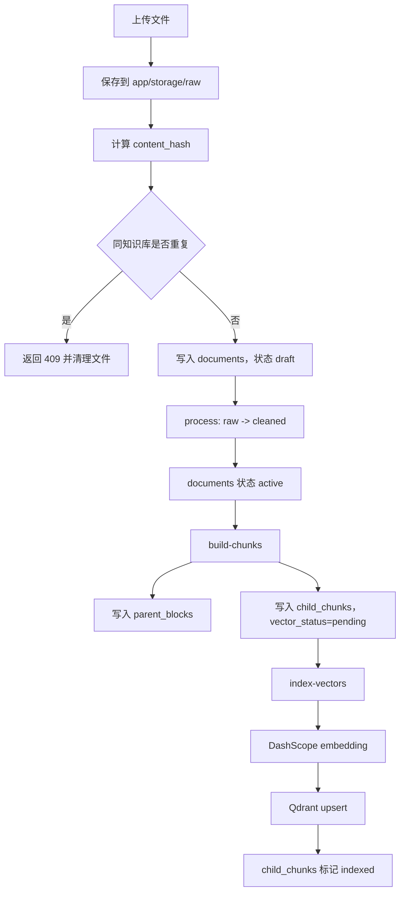

# AJ3Q Knowledge Admin API 项目文档

## 1. 项目定位

本项目是一个知识库文档管理与向量索引服务，当前代码主线围绕“后台管理侧文档入库”展开：

1. 上传原始文档，并写入文档元数据。
2. 对原始文档进行清洗，生成 cleaned 文件。
3. 将 cleaned 文本构建为 parent block 与 child chunk。
4. 调用 DashScope / Qwen embedding 接口生成向量。
5. 将 child chunk 向量写入 Qdrant。

当前新版主入口是 `app/main.py`，而根目录 `main.py` 仍保留旧 Agent API 代码，引用了当前仓库中不存在的 `KBagent` 模块，暂不应作为新版服务入口。

## 2. 当前代码结构

```text
agent-knowledge/
├── app/
│   ├── main.py                         # 新版 FastAPI 入口
│   ├── app_config/settings.py          # 新版核心配置
│   ├── db/session.py                   # SQLAlchemy engine/session/Base
│   ├── models/                         # SQLAlchemy ORM 模型
│   ├── schemas/                        # Pydantic 请求/响应模型
│   ├── repositories/                   # 数据库访问层
│   ├── processors/                     # 原始文件 -> cleaned 文件
│   ├── chunkers/                       # cleaned 文本 -> parent/child chunks
│   ├── services/                       # 上传、处理、分块、向量索引业务编排
│   ├── vectorstores/qdrant_store.py    # Qdrant 写入封装
│   ├── utils/file_security.py          # 文件名、扩展名、Content-Type、hash 校验
│   └── storage/                        # 当前本地样例/运行期文件
├── alembic/                            # 数据库迁移
├── core/observability/                 # JSONL 上传日志
├── main_config/                        # 日志等旧/独立配置
├── utils/file_cleanup.py               # 上传失败后的文件清理
├── main.py                             # 旧 Agent API 入口，当前与新版结构不匹配
└── AGENTS.md                           # 旧版项目说明，与当前代码存在明显差异
```

## 3. 分层架构

当前新版代码的主要依赖方向如下：

```text
app/main.py
  -> app/services/
    -> app/repositories/
      -> app/models/
    -> app/processors/
    -> app/chunkers/
    -> app/vectorstores/
  -> app/db/session.py
  -> app/app_config/settings.py
```

各层职责：

| 层 | 目录 | 职责 |
|---|---|---|
| API 层 | `app/main.py` | 定义 FastAPI 路由，解析上传表单，注入数据库 session |
| Service 层 | `app/services/` | 编排业务流程，例如上传、清洗、分块、向量索引 |
| Repository 层 | `app/repositories/` | 封装 ORM 查询、创建、状态更新 |
| Model 层 | `app/models/` | 定义数据库表结构 |
| Processor 层 | `app/processors/` | 不同文件类型的清洗策略 |
| Chunker 层 | `app/chunkers/` | 构建 parent block 与 child chunk |
| VectorStore 层 | `app/vectorstores/` | Qdrant collection 创建与 points upsert |
| Config 层 | `app/app_config/settings.py` | 存储上传、数据库、Qdrant、embedding 配置 |

## 4. HTTP 接口

### 4.1 上传文档

```http
POST /api/admin/documents/upload
Content-Type: multipart/form-data
```

表单字段：

| 字段 | 类型 | 必填 | 说明 |
|---|---|---|---|
| `file` | UploadFile | 是 | 上传文件 |
| `title` | string | 是 | 文档标题 |
| `kb_id` | int | 是 | 知识库 ID |
| `domain_code` | string | 是 | 领域编码 |
| `business_scene` | string | 否 | 业务场景 |
| `risk_level` | enum | 否 | `low` / `medium` / `high` / `critical`，默认 `low` |
| `effective_at` | datetime | 否 | 生效时间 |
| `expired_at` | datetime | 否 | 过期时间 |

核心行为：

- 校验文件名、扩展名和 Content-Type。
- 生成 `DOC_yyyyMMddHHmmss_xxxxxxxx` 格式的 `doc_code`。
- 将原始文件保存到 `RAW_STORAGE_DIR`。
- 计算 SHA-256 hash。
- 在同一个知识库内按 hash 查重。
- 创建 `documents` 记录，初始状态为 `draft`。
- 写入 JSONL 上传过程日志。

### 4.2 处理文档

```http
POST /api/admin/documents/{document_id}/process
```

核心行为：

- 只允许处理 `draft` 或 `failed` 状态文档。
- 根据 `source_type` 从 processor factory 获取处理器。
- 将原始文件清洗后写入 `CLEANED_STORAGE_DIR`。
- 更新 `documents.cleaned_uri`。
- 成功后将文档状态更新为 `active`。
- 失败后删除已生成的 cleaned 文件，并将状态更新为 `failed`。

当前 processor 支持情况：

| source_type | Processor | 状态 |
|---|---|---|
| `txt` | `TxtProcessor` | 已实现 |
| `md` | `MdProcessor` | 已实现 |
| `csv` | `CsvProcessor` | 当前为空实现，不可实际使用 |
| `pdf` | 无 processor 映射 | 上传白名单包含，但处理阶段不支持 |

### 4.3 构建 chunks

```http
POST /api/admin/documents/{document_id}/build-chunks
```

核心行为：

- 要求文档已有 `cleaned_uri`。
- 要求文档状态为 `active`。
- 读取 cleaned 文本。
- 根据 `source_type` 获取 chunker。
- 删除该文档已有 child chunks 与 parent blocks。
- 重新写入 `parent_blocks` 与 `child_chunks`。
- child chunk 的初始 `vector_status` 为 `pending`。

当前 chunker 支持情况：

| source_type | Chunker | 策略 |
|---|---|---|
| `txt` | `TextChunker` | 先按段落构建 parent block，再按长度切 child chunk |
| `md` | `MarkdownChunker` | 按 Markdown heading 维护 section_path，按 section 构建 parent block |
| `csv` | 无 | 不支持 |
| `pdf` | 无 | 不支持 |

### 4.4 写入向量索引

```http
POST /api/admin/documents/{document_id}/index-vectors
```

核心行为：

- 查询该文档下 `status=active` 且 `vector_status=pending` 的 child chunks。
- 将 chunks 标记为 `indexing`。
- 批量调用 DashScope / Qwen embedding。
- 校验返回向量数量和维度。
- 将向量 upsert 到 Qdrant collection。
- 将 child chunks 标记为 `indexed`，并写入 `qdrant_point_id` 和 `indexed_at`。
- 失败时尝试将本批 chunks 标记为 `failed`。

## 5. 端到端数据流



## 6. 数据模型概要

### 6.1 `knowledge_bases`

知识库主表，包含知识库编码、名称、领域、业务场景、状态、可见性、owner、embedding 模型和 Qdrant collection 名称。

关键字段：

- `kb_code`
- `name`
- `domain_code`
- `business_scene`
- `status`
- `visibility`
- `embedding_model`
- `vector_collection`

### 6.2 `documents`

文档元数据表，记录原始文件、清洗文件、hash、状态、版本和生效期。

关键字段：

- `doc_code`
- `kb_id`
- `domain_code`
- `business_scene`
- `title`
- `source_type`
- `source_uri`
- `cleaned_uri`
- `content_hash`
- `status`
- `risk_level`
- `effective_at`
- `expired_at`
- `indexed_at`

常见状态：

- `draft`：上传完成，尚未处理。
- `indexing`：处理过程中临时状态。
- `active`：处理成功，可分块。
- `failed`：处理失败，可重试。
- `deleted` / `archived` / `replaced`：查重时会被排除。

### 6.3 `parent_blocks`

父块表，用于保存较大的语义单元，例如段落或 Markdown section。

关键字段：

- `parent_code`
- `kb_id`
- `doc_id`
- `block_type`
- `title`
- `section_path`
- `content`
- `content_hash`
- `block_index`
- `status`
- `version`

### 6.4 `child_chunks`

子块表，用于 embedding 和向量检索。

关键字段：

- `chunk_code`
- `parent_id`
- `doc_id`
- `kb_id`
- `chunk_index`
- `chunk_type`
- `content`
- `embedding_text`
- `vector_status`
- `qdrant_point_id`
- `indexed_at`

常见向量状态：

- `pending`：等待向量化。
- `indexing`：向量化或写入中。
- `indexed`：已写入 Qdrant。
- `failed`：向量索引失败。

## 7. 配置说明

主要配置位于 `app/app_config/settings.py`。

| 配置 | 当前值/含义 |
|---|---|
| `BASE_STORAGE_DIR` | `storage` |
| `RAW_STORAGE_DIR` | `storage/raw` |
| `CLEANED_STORAGE_DIR` | `storage/cleaned` |
| `MAX_UPLOAD_FILE_SIZE` | `2MB` |
| `ALLOWED_FILE_EXTENSIONS` | `txt`、`md`、`pdf`、`csv` |
| `ALLOWED_CONTENT_TYPES` | text、csv、pdf、octet-stream 等 |
| `SQLALCHEMY_DATABASE_URL` | MySQL 连接串 |
| `QDRANT_URL` | `http://127.0.0.1:6333` |
| `QDRANT_COLLECTION_NAME` | `knowledge_chunks` |
| `DASHSCOPE_BASE_URL` | OpenAI-compatible DashScope endpoint |
| `EMBEDDING_MODEL_NAME` | `text-embedding-v3` |
| `EMBEDDING_VECTOR_SIZE` | `1024` |
| `EMBEDDING_BATCH_SIZE` | `10` |

数据库连接串和 DashScope API key 必须由部署环境或项目根目录的 `.env` 提供；`.env` 已被 Git 忽略，不应提交真实密钥。

## 8. 依赖

仓库当前没有 `requirements.txt`、`pyproject.toml` 或 `setup.py`。从源码导入可以推断至少需要：

```text
fastapi
uvicorn
python-multipart
pydantic
sqlalchemy
pymysql
alembic
qdrant-client
openai
```

如果后续补齐 PDF、CSV 或更复杂文档解析，还可能需要：

```text
pandas
pypdf
unstructured
```

## 9. 本地运行

建议使用新版入口：

```powershell
py -m uvicorn app.main:app --reload --host 127.0.0.1 --port 8000
```

运行前需要准备：

1. MySQL 数据库 `aj3q_knowledge`。
2. 已执行 Alembic 迁移。
3. Qdrant 服务运行在 `http://127.0.0.1:6333`。
4. DashScope embedding API key 可用。
5. 安装上文依赖。

数据库迁移命令示例：

```powershell
py -m alembic upgrade head
```

## 10. 当前代码分析与风险

### 10.1 新旧入口不一致

根目录 `main.py` 仍引用旧结构的 `KBagent.kb_agent`，但当前仓库没有该目录。新版 API 入口应以 `app/main.py` 为准。

### 10.2 AGENTS.md 与当前代码不一致

`AGENTS.md` 描述的是旧版 RAG 结构，例如 `facade/`、`KBagent/`、`processors/`、`Chroma`、`BM25` 等；当前代码已经演进为 `app/services`、SQLAlchemy、Qdrant 的后台管理 API。后续维护应以当前源码为准，或同步更新 `AGENTS.md`。

### 10.3 文件类型白名单与实际能力不一致

上传白名单允许 `pdf` 和 `csv`，但：

- `pdf` 没有 processor，也没有 chunker。
- `csv` 的 processor 当前是空类，没有实现 `process()`。
- chunker 仅支持 `txt` 和 `md`。

这会导致部分文件上传成功，但后续处理或分块失败。

### 10.4 存储路径基准不稳定

`BASE_STORAGE_DIR = Path("storage")` 是相对路径，会受进程启动目录影响。若从项目根启动，会写到 `./storage`；但当前仓库样例文件在 `app/storage/` 下，和配置存在潜在不一致。

建议改为基于项目根或 `app` 目录的绝对路径。

### 10.5 配置与密钥管理

应用统一从系统环境或项目根目录的 `.env` 读取配置，仓库只提交不含真实值的 `.env.example`。真实数据库连接串、API Key 和 Token 不得提交或写入日志。

### 10.6 缺少依赖清单和自动化验证

当前没有依赖清单、测试、lint、typecheck、CI。建议至少补齐：

- `requirements.txt`
- 一个最小启动导入测试
- processor/chunker 的单元测试
- 上传接口的集成测试

### 10.7 向量索引事务边界需关注

`index_document_vectors()` 先将 chunk 标记为 `indexing` 并提交，再调用外部 embedding 和 Qdrant。失败时会回滚当前事务并尝试标记 failed。这个设计可以避免长事务，但需要考虑以下情况：

- Qdrant upsert 成功、数据库标记 indexed 失败时，会出现外部向量和数据库状态不一致。
- 重试时 point id 使用 `chunk.id`，可覆盖同一 chunk 的向量，这一点有利于幂等。

### 10.8 缺少查询接口

当前代码只有上传、处理、分块、索引，没有面向检索的 API，也没有 Qdrant search 封装。项目目前更像“知识库入库管理服务”，而不是完整 RAG 问答服务。

## 11. 建议后续路线

短期优先级：

1. 明确入口，只保留或标注 `app/main.py` 为新版启动入口。
2. 补 `requirements.txt`。
3. 将密钥和连接串迁移到环境变量。
4. 修正存储目录基准，统一 `storage` 实际位置。
5. 对上传白名单和 processor/chunker 支持范围做一致化处理。

中期优先级：

1. 完成 CSV/PDF 的 processor 和 chunker，或暂时从白名单移除。
2. 增加 Qdrant search 接口。
3. 增加 document、parent block、child chunk 的查询和管理接口。
4. 给上传、处理、分块、索引分别补最小测试。
5. 优化上传日志和业务日志的编码、字段规范与查询方式。

长期优先级：

1. 建立完整 RAG 检索链路：过滤、向量召回、重排、父块扩展、引用返回。
2. 支持多知识库、多 collection 或按知识库隔离索引。
3. 引入异步任务队列处理耗时步骤，例如 embedding 和索引写入。
4. 为文档版本、替换、软删除、恢复建立完整 API。

## 12. 本轮验证记录

本轮执行过以下只读/非破坏性检查：

```powershell
rg --files
git status --short
py -m compileall app core main_config utils main.py
py -c "import app.main; print('import ok')"
```

结果：

- `py -m compileall ...` 通过，说明语法层面可编译。
- `py -c "import app.main"` 失败，原因是当前环境缺少 `sqlalchemy`，不是源码语法错误。
- 未执行服务启动和接口调用，因为本轮没有安装依赖、启动 MySQL、启动 Qdrant 或配置真实运行环境。
